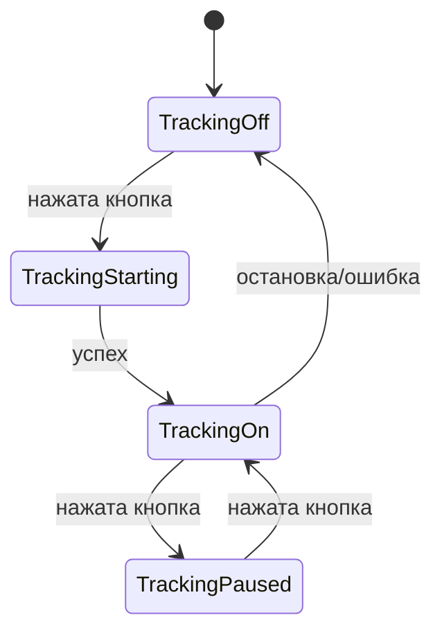

# Поток данных и событий для трекинга (Start/Pause/Resume)

## Общая схема слоёв

```
[AppTrackingButton]
    ↓ onPressed
[TrackingBloc]
    ↓ события (TrackingTogglePressed, TrackingStart, TrackingCheckStatus)
[LocationTrackingService]
    ↓ методы (startTracking, pauseTracking, resumeTracking)
[TrackManager]
    ↓ буферизация и сегментация
[GpsDataManager]
    ↓ поток GPS
[UserTrackRepository]
    ↓ сохранение трека
```

## Диаграмма переходов состояний кнопки



## Подробный сценарий работы

### 1. Нажатие кнопки
- Пользователь нажимает кнопку (AppTrackingButton → TrackingToggleButton)
- Вызов: `onPressed` → отправка события в Bloc

### 2. Обработка события в Bloc
- Bloc получает событие:
    - Если нет пользователя: TrackingNoUser
    - Если TrackingOff: вызывает `_startTracking()`
    - Если TrackingOn: вызывает `_pauseTracking()`
    - Если TrackingPaused: вызывает `_resumeTracking()`
- Bloc вызывает соответствующий метод сервиса

### 3. Работа сервиса
- LocationTrackingService:
    - `startTracking(user)` — запускает GPS, инициализирует TrackManager
    - `pauseTracking()` — ставит трекинг на паузу
    - `resumeTracking()` — возобновляет трекинг
- Сервис подписывается на поток GPS данных
- Каждая новая позиция:
    - Фильтруется
    - Передаётся в TrackManager через `addGpsPoint`
    - TrackManager буферизует, сегментирует, сохраняет

### 4. TrackManager
- Буферизует точки в памяти
- По условиям (кол-во точек, время, расстояние, остановка) создаёт новый сегмент
- Сохраняет сегменты в репозиторий
- Через стрим `trackUpdateStream` отправляет обновлённый трек в UI

### 5. UI
- Подписан на стрим `trackUpdateStream` через Provider/BLoC
- При каждом обновлении трека перерисовывает линию на карте

## Ключевые точки для дебага
- События: TrackingTogglePressed, TrackingStart, TrackingCheckStatus
- Подписка на стримы: `trackUpdateStream`, `positionStream`
- Методы: `startTracking`, `pauseTracking`, `resumeTracking`, `addGpsPoint`
- Состояния: TrackingOff, TrackingOn, TrackingPaused, TrackingNoUser

## Быстрый чек-лист для поиска багов
- Проверить, что Bloc получает события от кнопки
- Проверить, что сервис реально запускает/останавливает GPS
- Проверить, что TrackManager получает точки и обновляет трек
- Проверить, что UI подписан на стрим и перерисовывает карту

---

**Документ создан: 2025-09-08**

